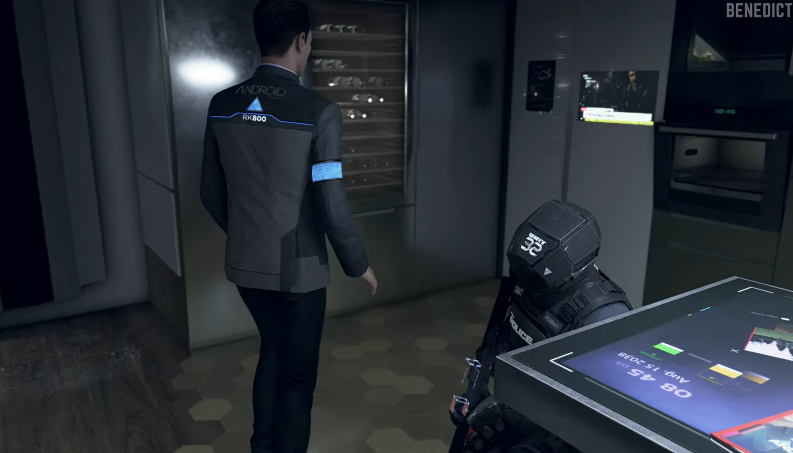
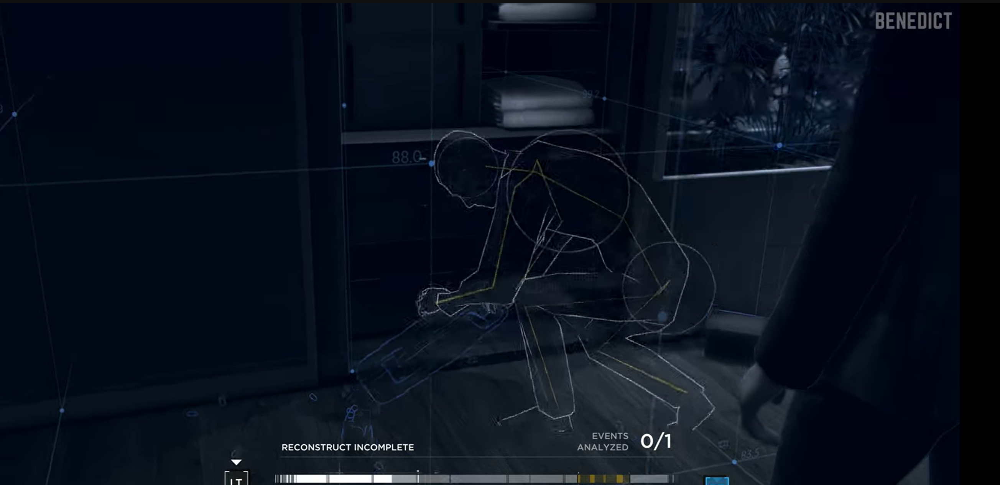
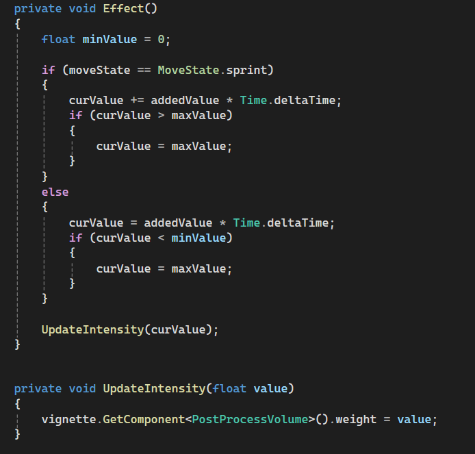
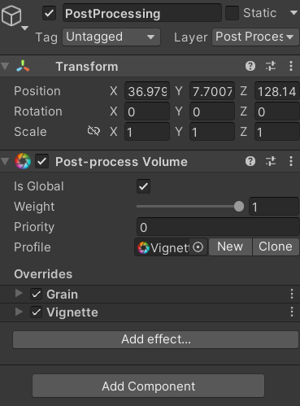

# GDIM 33 In-Class Activities
## W1
### Activity 1

1. Looking at my board, alot of the games have a very futuristic y2k aesthetic. Between Jetset radio Sonic Rider, the visual design of the games corelate heavily with a sci fi theme with the use of older technology. Simliary, many of the games i have dark tones with bright colors. Games like Hades 2 and Sonic adventure 2 have really bright colors contrasting with dark settings and spaces.  Additonally, most of the games have mechanics where fast movement is priotized, like bombrush cyberfunk's different traversal styles.

2. Looking at Evrin lee's board, we both like bright colors with a bit darker tones, where the colors of the characters and elements within a scene is contrasted with the overall dark backgrounds and settings. For example, we both really like Hades design and bonded over the characters and sceneic pieces. 

3. One of the LA's at my table that came up to see my board really and liked Twilight princess. We talked about how we both have not completed Twilight princess but have a very fond apperication of the game. Futhurmore, he also regonized the bleach drawing and was familiar with the anime but hadn't really watched the show.

### Activity 2  

## W2

## W3
### Activity 1

### Activity 2
1. Saving the event names for state transition as scene variables is useful because it makes the events triggable throughout every graph. Since the names of the graphs are saved as scene variables, that name and event is accesible through every graph of the scene. 

2. While testing if the onMouseDown event work, the debug tool message tool was useful to know at an early stage if the interaction worked correctly. For instance, when i first made the graph, i got an error message first, and after debugging, the debug message i created notified me that the code was working correctly. 

3. My game I need a break will be using a Set Cursor Lock State. Since my game is a first person that will also have a dialogue system similar to the demo, i will defeintely be using a cursor lock state to switch between the UI and gameplay.

4. My game I need a break may have a use to have a game state. When the player spawns in, i want there to be a small area they can interact with NPC's or just walk around, and then start the obstacle course once they finish there interaction with the NPC is finished. For this, i could implement 2 states, one where the player is wandering, and another where the player is actively locked in the obstacle course.

## W4
### Activity 1
Currently, my playtest has:
-First person movement with a jump, dash, and sprint
-a sample obstacle course 
-Sceneic game objedcts 

My playtest goal is to see if the players can:
-Complete the sample obstacle
-stress test my movement mechanics

Playtest members
Evrin Lee, Nicole Yang

Notes:
-Jumping is very inconsistent (will be higher sometimes than others)
-Like the city assets 
-Not able to know how sprint and dash work 
-Can complete the obstacle course, but VERY hard

### Activity 2
Since the main functionality of the graph uses scriptable objects, a writer would be able to add more dialogue lines to the setup without worrying about the backend code. Since the graph automatically creates buttons and uses scriptable objects to generate the dialogue UI, the writer can create the dialogue scriptable objects and only have to hook them up in the inspector.

The writer could make an infinte number of dialogue nodes as long as there is 4 or less reply options. Since the graph is built to keep generating buttons and reply options from each dialogue new node, the writer would be able to keep making dialogue nodes as long as there setup up properly.

Regenrate nodes is a project function that will look for any missing or new nodes added to the unity project and will restore/add them to the project. Since the programmer can make there own events and other nodes on top of the preset unity nodes, unity accounts for this by having a designated button to add any more nodes that are not apart of the base unity nodes. Additonally, if the unity project has any missing nodes from errors or bugs, the regenerate node button will restore them. 

## W5
### Activity 1
feature: NPC interaction

1. When the NPC is clicked, a dialogue box appears
    1. Grab the game object that hold the Dialogue UI
    2. Use OnMouseDown() to see when the player clicks on the NPC
    3. Freeze the movement of the player rigidbody and Open the Dialogue UI box
2. When the player clicks the dialogue button, a new prompt appears
    1. Create a scriptable object that holds the lines of the NPC
    2. Grab a button on the Dialogue UI box
    3. Everytime the player clicks on the Button, new text appear.
3. When the player finishes all of the text, The player is teleported to the beginning of the level
    1. Get the length of the scriptable object to see how big the list of lines are
    2. Once the player gets to the last piece of text, Send an event to the game controller telling the game started
    3. Spawn the player at the beginning of the level

### Activity 2
Today, i was able to get a majority of the NPC interaction done. I was able to get the dialogue box to open when the player clicks on the Object with the NPC interactino script, as well as unlock the mouse and show the cursor. Futhurmore, the player can advance the dialogue by pressing the button on the dialogue box. Finally, i created my GameController locator and invoked an event that will activate once the dialogue is finished.

## W6
### Activity 1 
New: 
-Added NPC (Not anims yet) and functinoality to spawn player into spawn level 
-Readjusted grouded detection that makes the game run smoother 
-changed the movement feeling to a more "slippery" style

[Itch Link](https://romarick-a.itch.io/i-need-a-break-milestone-2)

Playtest Goals:
-See if players like the improved movement 
-See if players can understand what to do with little on screen guidance
-See if player can complete the course with a little difficulty

Notes:
-Movement functinoality is alot better compared to last week
-The slippery effect makes the game very very hard
-jumping is still a bit wonky but alot better
-Change the grounded drag to slip
-Player noticed to talk to the npc without any help

### Activity 2
1. When applying the mutiplier setting on the blend node, all of RGB values are mutiplied with each other. Since all of the RGB values are values between 0.0 and 1.0, that means when mutiplying the very small decimal number with each other, the resulting value will become smaller, making the final color darker as a result.

2. Since the mutiply setting mutiplies the small values from 0.0 to 1.0, by adding the alpha channel, the material will become more translucent since the alpha value will become smaller.

3. Since the sample2D is grabbing another texture2D, the node is pulling the coordinates from the game object that our texture2D is applied to.

4. I do find the concept of manipulating colors with numbers since I can fine tune saturation and the brigtness of colors without having to check and guess with a premade slider.

## W7
### Acitivty 1
1. The vertex data that is used for the debug shader comes from the shiba inu's mesh data, that tells the graph the different vector points which then disperses among the shiba inu model. 
 
2. Since the mesh is dispersing the colors among different axis on the model (x, y, z), when the color on the material notices that it is on a new axis of the model, it fills in that spot with the color with its respective color. For instance, on the mesh of the model, the coloring of the model is red on the y axis, however as soon as the material reaches a different axis, it replaces that color with either blue or green.

3. The shiba inu with vertex colors is less detailed than last weeks texture since it does not directly use the texture2D of the shiba inu, marking the position as best it can with the model data.

4. The nomrals of the shiba inu are weird since they either shade the dog in a random way and cut off at certain parts of the model.

5. Another kind of data that can be used that can be used with a debug shade is a alpha data value to test if the transparency of an object is being mapped correctly.

6. Since the mesh of the model is a 2D image, it does not account for the back of the quad's model since it would go into another dimension, making the image only appear on the front of the model. 

7. By using a additive feature to animate the model for the fire texture, the Texture would simulate an effect of moving up since the y axis coordiante of the map would increase a constant speed. 

## W8
### Activity 1
Whats New:
-Attempt at post processing effect 
-New fast descent
-decreased sensitivty 
-More grounded drag

Playtest goals:
-See how players like effect and how to expand on it
-see if players feel better on the ground
-see if the players can complete level

Playtest notes:
-Itch has a weird bug that makes the jumping act differently, fix it 
    -Grounded drag also affected
-Liked the effect, will expand on it later
-mouse sensitivty was a bit better

-beginning direction is a bit hard, but can fix after mechanics are tweaked

### Activity 2
Doing: 2C

1. Looking at the frame debugger, the FinalBlit pass is the name of the pass created during the acitivy. However, despite the name already making it obvious, since the pass is right after the fullscreen pass rendener and also is the last pass called, emphasizing the custom feature created.

2. At 0.5, the custom texture can slighlty be seen on the screen, whereas the custom texture with a lerp value of 1 can be seen fully and cannot be seen when a lerp value set to 0.

3. By changing the lerp value, the node works similar to an alpha value, changing the opactity of the custom texture to either be more or less visible.

4. By leaving the algorithmn alone, the sin value will flucatute between 1, 0, and negative 1 since it is using a time function in terms of sin. However, since the y values of the graph can only read numbers between 0 and 1, you have to make sure the value of the the alogrithmn is always postive and between 1 and 0.

## W9
### Activity 1
Game: Detroit Become Human

1. Xray vision during playback interactions 

Normal Gameplay:

Xray Vision:

    We would need to change the rendering effect on the camera to turn edown the saturation of the game (this is a fullscreen rendering effect)

    we would also need to make a second shader, attach the shader to a material and add the matieral to every interactable object. We need to code the shader to give the object a blue hue. Then, we'd need to turn it on whenever we enter "robot view" and turn it off in normal view in code (this is an object specific effect)

### Activity 2
Used PostProcessingVolume system built in unity, here is the snippet of code that i used processing effect.

For my game, i wanted to make the screen have a black circle aruond the camera when the player started to sprint. However, when i was trying to directly change the value of the vignette within the post processing volume componet, i kept getting an error that the vignette componet could not be obtained. After some tinkering, i decide to just change the intensity of the post processing volume componet itself rather than the vignette effect since the same result would come out.

## W10
### Activity 1
New things in build:
- Win condition that ends the game (no lose condition yet)
- new skybox
- custimozed lobby area
- polished mechanics

Playtest Goals:
- Confirm core mechanics are polished
- get feedback on post processing effect
- get feedback on game direction 

Notes:
core mechanics are far better feeling 
- Jump when respawn is alot but fixable
really like scenery and level objects

### Activity 2
Brainstorm:
- Choosing a genre of game that will be the main focus 
- try and define locator variables before doing anything
- writing down a diagram on paper  
- Start with something/simple/easy to keep momentum from later strong 
- define main concept of to build foundtation
- playtest with other pepole to get constant feedback 
- fix whats most limiting 
- start with a basic UI that you can add onto

For our planning straegy, my table came with first finding a genre, creating a diagram of the game, and starting with simple mechanic to build momentum in the creation of a game project.

Often a more thoughout plan with a strong concept and small foundation will that is manageable to pull off make in order to add  onto the game easier, rather than having a rough idea and struggling to add content to your game. 

### Activity 3

Today since most of my movement features and gameplay is done, i decided to create a basic UI and add on later to make the UI more appealing since its very barebones. I created a starting screen that once a button is pressed, the title screen will disappear and play music.

